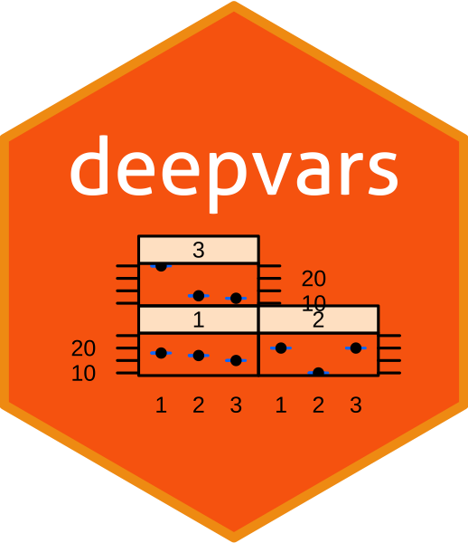

<!-- README.md is generated from README.Rmd. Please edit that file -->

```{r, include = FALSE}
knitr::opts_chunk$set(
  collapse = TRUE,
  comment = "#>",
  fig.path = "man/figures/README-",
  out.width = "100%"
)
```

<!-- badges: start -->
[](https://www.tidyverse.org/lifecycle/#experimental)
<!-- badges: end -->

# `deepvars`

The `deepvars` package provides a framework for Deep Vector Autoregression in R. The methodology is based on [Agusti, Altmeyer and Vidal-Quadras Costa (2021)](Vidal-Quadras Costa) - a working paper initially prepared as part of the [Masters Degree in Data Science](https://bse.eu/study/masters-programs/data-science-methodology) at [Barcelona School of Economics](https://bse.eu). For a summary of the current version of the working paper see [here](https://thevoice.bse.eu/2021/09/16/deep-vector-autoregression-for-macroeconomic-data/). 

```{r, fig.align='center', echo=FALSE}

```


## Installation

### Prerequisites

As one of its dependencies the `deepvars` uses `tensorflow`, which is an R interface to the popular [TensorFlow](https://www.tensorflow.org) library. We have tried to automate the TensorFlow configuration as explained [here](https://rstudio.github.io/reticulate/articles/python_dependencies.html). 

```{r, eval=FALSE}
install.packages("tensorflow")
tensorflow::install_tensorflow()
```

For uncertainty quantification we use `tensorflow_probability` for Bayesian inference.

```{r, eval=FALSE}
install.packages("tfprobability")
tfprobability::install_tfprobability()
```

Should you run into issues you may have to manually install the TensorFlow dependencies. Detailed instructions to this end can be found [here](https://tensorflow.rstudio.com/installation/).

### Install

You can either clone this repository and install from source or simply run the below in R:

```{r, eval=FALSE}
devtools::install_github("pat-alt/deepvars", build_vignettes=TRUE)
```

Once installed you need to attach the package:

```{r}
library(deepvars)
```

## Getting started

Full documenation of the package is still missing. In the meantime, detailed guidance on different topics and estimation methods covered by `deepvars`, can be found in the vignettes. Simply type the following command once you have completed the steps above:

```{r, eval=FALSE}
utils::browseVignettes('deepvars')
```

## Citation

If you would like to cite our work in your own research, we'd much appreciate it. Please cite this package as follows:

```
@Manual{,
    title = {deepvars: Deep Vector Autoregression},
    author = {Patrick Altmeyer},
    note = {R package version 0.1.0},
  }
```

Please cite the related working paper as follows:

```
@article{agusti2021deep,
	author = {Altmeyer, Patrick and Agusti, Marc and Vidal-Quadras Costa, Ignacio},
	title = {Deep Vector Autoregression for Macroeconomic Data},
	year = {2021}}
```


